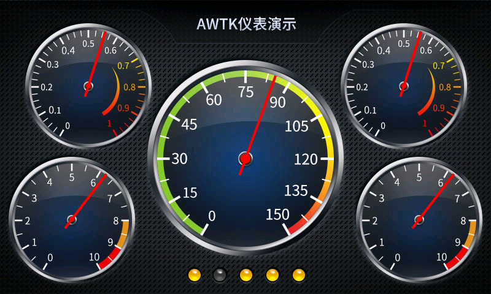

# AWTK 示例使用说明

#### 项目介绍：

- HelloDesigner-Demo：最简单的入门 Demo，包含基本的文本和按钮控件使用方法
- Chart.v2-Demo：图表演示 Demo，包含仪表、饼图、曲线图、柱状图
- Meter.v2-Demo：普通工业仪表演示 Demo
- CleanAir.v2-Demo：新风系统演示 Demo
- MusicPlayer.v2-Demo：音乐播放器演示 Demo
- SmartWatch.v2-Demo：智能手表演示 Demo

> HelloWorld.Xml-Demo：用传统手写 XML 方式开发的工程模板，可以用 assets_gen.bat 生成资源，但不能用 Designer 打开工程，也不依赖 Designer 生成资源


#### Windows 使用方法：

1. 确保已经安装好 VS2015（Visual C++）、Python2.7（x64）、SCons3.0.1 等工具

2. 将 awtk 和 awtk-examples 下载到同一个文件夹下

3. 修改 awtk 文件夹的 awtk_config.py 脚本使用 AGGE 渲染方式

   > AGGE 渲染方式兼容性最好，可以兼容 Windows、Linux、macOS 以及各种嵌入式平台

   ```
   NANOVG_BACKEND='AGGE'
   ```

4. 进入 awtk 文件夹，在命令行中输入 scons 编译 awtk

   ```
   C:\zlgopen\awtk> scons
   ```

5. 进入 awtk-examples 中某个项目文件夹，在命令行中输入 scons 编译项目

   ```
   C:\zlgopen\awtk-examples\HelloDesigner-Demo> scons
   ```

6. 进入项目的 bin 文件夹启动 demo

   ```
   C:\zlgopen\awtk-examples\HelloDesigner-Demo\bin> demo.exe
   ```


#### 运行效果截图：





